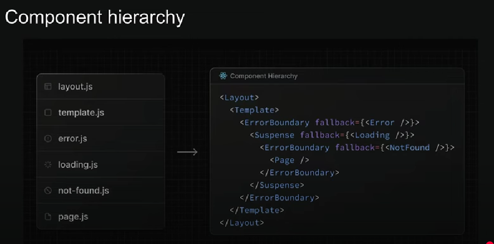

# NextEdge

# React Server Components
React Server Components is a new architecture that was introduced by the React Team and quickly adopted by Next.js
This architecture introduces a new approach to creating React Components by dividing them into two distinct types: 
1.  **Server Components**
2.  **Client Components**

## Server Components:

1. By Default Next.js treats all components as Server Components
2. These Components can perform server side tasks like reading files or fetching data directly from a database
3. The trade-off is that they can't use React hooks or handle user interactions

## Client Components:

1. To create a Client Component, you'll need to add the "use client" directive at the top of your component file
2. while client components cant perform server-side task like reading files or fetching data directly from a database they can use hooks and handle user interactions
3. Client component are the traditional React components you are already familiar with from previous versions of React.

## Routing:

Next.Js has a file-system based routing system
URLs you can access in your browser are determined by how you organize your files and folder in your code.

### Routing Conventions
1. All Routes must live inside the app folder
2. Route files must be named either page.js or page.tsx
3. Each folder represents a segment of the URL path

When these convenstions are followed. the file automatically becomes available as a route.

# Dynamic Routes: 
Refer products folder for dynamic routes understanding.

# Catch All Segments
/docs/feature1/concept1
/docs/feature1/concept2
/docs/feature2/concept1
/docs/feature2/concept2
20Features * 20Concepts = 400
20Features * 1Concept = 20
1Feature * 1Concept = 1
/docs/feature1/concept1/example1.../
need just 1 file to handle
Refer docs folder for understandings.

## Not Found Page
refer to component not-found.
NotFound component doesnot accept parms, instead it accept usePathName.
usePathname only works in Client Component so use use-client.

## File Colocation
File colocation is the practice of placing related files together in the same directory to improve organization, maintainability, and discoverability. In Next.js, this typically means keeping files like components, styles, tests, and hooks alongside the relevant page or feature.
refer- dashboard folder where we have a comp of linechart without worrying that this will be rendered while accessing dashboard.

## Private Folders:
A way to tell Next.js, "Hey, this folder is just for internal stuff - dont include it in the routing system"
1. The folder and all its subfolder are excluded from routing.
2. Add an underscore at the start of the folder name.
It is useful for a bunch of things:
- keeping your ui logic seperate from routing logic.
- Having a consistent way to organize internal files in your project.
- Making it easier to group related files in your code editor.
- Avoiding potential naming conflicts with future Next.js file naming conventions.
refer _lib folder:

# Route Groups:

Lets us logically organize our routes and project files without impacting the URL structure.
- refer auth folder to get the concept.
- initially we are using pages inside auth, but to get rid of auth we can use parenthesis.

Allow you to organize your application’s routes without affecting the URL structure. This is useful for structuring your project logically without exposing unnecessary folder names in the final URL.

# Layout
Pages are route specific components
A layout is UI that shared between multiple pages in you app. It creates a consistent UI that renders throughout application.
Think it as a: 
Header
Content
Footer
Now this Header and Footer will be fixed irrespective of page routing.
Creating Layout:
Default export a React Component from a layout.js or layout.tsx file
The component takes a children prop, which next js populate with your page content. 
refer layout.tsx file:

# Nested Layouts
Allow you to reuse layouts across multiple pages while maintaining a hierarchical structure.
Refer to productId > layout.tsx file 

# Multi Layouts: 
In Next.js, multiple layouts allow different sections of your app to have separate layouts. Instead of using a single layout for all pages, you can apply different layouts to different parts of your application.

For example:

- A public layout for pages like Home and About
- An admin layout for dashboard pages
- A user layout for authenticated user pages

# Routing metadata
The Metadata API in Next.js is a powerful feature that lets you define metadta for each page
Metadata ensures our content looks great when its shared or indexed by search engines.
Two ways to handle metadata in layout.tsx or page.tsx files:
1. export a static metadata object
2. export a dynamic generateMetadata function

## Metadata Rules:
- Both layout.tsx and page.tsx can export metadata. Layout metadata applies to all its pages, while page metadata is specific to that page.
- Metadata follows a top-down order, starting from the root level
- When metadata exsists in multiple places along a route, they merge together with page metadata overriding layout metadata for matching properties.

to use the client componnet with metadata import from another file: refer counter folder

# Title Metadata
- The Title fields primary purpose is to define the document title 
- It can be either a string or an **Object**

# Navigations
File based routing system
Defining routes for our application's root, nested routes, dynamic routes, and catch-all routes
We've been typing URLs directly in the browser to test three routes

Users 
- click on links
- get redirected after certain actions

Link Component Navigation
For client-side navigation, next.js gives us the <Link> component 

The <Link> component is a react component that extends the HTML <a> element and its the primary way to navigate between routwes in Next Js. 

# Active Link 
giving a different look and style to actives link.
usePathName hook to be used to check active-link, and it works only in client component. (use client)
refer auth folder/ layout file to get this concept

## params and searchParams
For a given URL: 
params is a promise that resolves to an object containing the dynamic route parameter (like id)
searchParams is a promise that resolves to an object containing the query parameters (like filtering and sorting)
while page.tsx has access to both params and searchParams, layout.tsx only has acess to params.

**client component("use client") doesnt support async await**
In case of client compoent, we have a hook for promising resolving - use hook.
In case of server compoent, we have a async await for promise resolving.
refer articles - folter to get the above\

## Navigating Programitacally
Often we do this by history.push on a click handler
refer order-product.
here we are using redirect(refer reviewid) and useRouter hook for redirecting.

# Template: 
are similar to layout in that they are also UI shared between multiple pages in your app.
whenever a user navigates between routes sharing templates, you get a completly fresh start
- a new template instances is mounted 
- DOM element are recreated
- state is cleared
- effects are resynchronized.
You can use it to make multiple pages look consistent without rewriting the same code over and over.
refer auth folder
**Unlike** normal layouts, which persist their state when navigating between pages, templates reset their state whenever a new instance is rendered.

## Loading tsx
The file help us create loading states that user see while waiting for content to laod in specific route.
refer blog to get this.

## Error tsx: 
Error boundary component must me client component
refer reviewId to get this.
- It automatically wraps route segments and their nested children in a react eror boundary
- you cac create custom error UI
- It isolates error to affected segments
- it enable you to attempt to recover from error when requiring a full page reload.

### Error Handling in nested routes
Error always bubble up to find the closest parent error boundary.
An error.tsx file handle errors not just for its own folder but also for all the nested segment file below too.
By strategically placing error.tsx files at different levels in your route folders, you can control exactly how detailed your error handling texts.
Where you put your error.tsx file makes a huge difference - it determines exactly which parts of UI get affected when thing go wrong.    
** Check out the 26-30 Tutorial to get the above. Hard to digest.**

# Next.js Templates

## Core Behavior
- 🔄 **Re-mount on navigation** between child routes (unlike Layouts which persist)
- 🏗️ **Recreate DOM** elements during route transitions
- ♻️ **Reset state** when navigating between sibling routes

## When to Use Templates

### Ideal Cases:
| Use Case | Description |
|----------|-------------|
| **Fresh DOM State** | When you need components to completely reset on navigation |
| **Effect Re-triggering** | When `useEffect` hooks should re-run on route changes |
| **Route-Specific Wrappers** | Different containers for specific route groups |
| **Clean State Transitions** | Forms that should reset when changing sections |

### Practical Examples:
1. Authentication flows (login/signup pages)
2. Multi-step forms (wizard patterns)
3. Tabbed interfaces where state shouldn't persist
4. Pages with enter/exit animations

## When NOT to Use
- ❌ Persistent navigation elements (use Layouts)
- ❌ Global state providers
- ❌ Shared UI that should remain mounted

## Key Differences from Layouts
| Behavior          | Template              | Layout                |
|-------------------|-----------------------|-----------------------|
| **DOM Persistence** | Recreates on nav     | Persists              |
| **State**          | Resets                | Maintains             |
| **useEffect**      | Re-runs               | Doesn't re-run        |
| **Performance**    | Higher cost           | More efficient        |

## Best Practices
1. **Use sparingly** - Default to Layouts when possible
2. **Isolate templates** - Keep them close to the routes that need them
3. **Monitor performance** - Excessive re-mounting can impact UX
4. **Combine wisely** - Can be used with Layouts in nested routes


# Next.js Layouts

## Core Behavior
- ♻️ **Persist across navigation** (unlike Templates which re-mount)
- 🏗️ **Maintain DOM elements** during route transitions
- 💾 **Preserve state** when navigating between child routes

## When to Use Layouts

### Ideal Cases:
| Use Case | Description |
|----------|-------------|
| **Persistent UI** | Headers, footers, sidebars |
| **Global State** | Auth providers, theme context |
| **Shared Components** | Navigation, banners, modals |
| **Performance Critical** | Avoid re-rendering heavy components |

### Practical Examples:
1. Main site navigation
2. Dashboard shells
3. Authentication wrappers
4. Consistent page containers

## When NOT to Use
- ❌ Route-specific resets (use Templates)
- ❌ Animations requiring re-mount
- ❌ Forms that should clear on navigation

## Key Differences from Templates
| Behavior          | Layout                | Template              |
|-------------------|-----------------------|-----------------------|
| **DOM Persistence** | Maintains            | Recreates             |
| **State**          | Preserves            | Resets                |
| **useEffect**      | Runs once            | Re-runs on nav        |
| **Performance**    | More efficient       | Higher cost           |

## Best Practices
1. **Default choice** - Use for most shared UI
2. **Nest strategically** - Create layout hierarchies
3. **Isolate client components** - Keep server components pure
4. **Combine with Templates** - Use both in complex apps

## Advanced Patterns
- **Parallel Routes** - Show multiple pages simultaneously
- **Intercepting Routes** - Modal-like experiences
- **Conditional Layouts** - Different layouts for auth states

## Route Groups

### Basic Usage
```bash
app/
├── (group-name)/
│   ├── route1/
│   └── route2/


---

### **Practical Scenarios**  
1. **Marketing vs App Routes**:  
   - `(marketing)` → Lightweight pages  
   - `(app)` → Authenticated dashboard  

2. **A/B Testing**:  
   - `(variant-a)` and `(variant-b)` with different layouts  

3. **API Versioning**:  
   - `(v1)/api/` and `(v2)/api/`  

Route groups help maintain clean project structure while keeping URLs simple! 🚀


## Dynamic Routes

### Basic Syntax
```bash
app/
├── [param]/          # Single segment
│   └── page.js       → /value
└── [...path]/        # Catch-all
    └── page.js       → /a/b/c
```

### Key Features
- 🔗 **Flexible URLs**: Handle infinite variations
- 📦 **Automatic params**: Access via `params` prop
- 🧩 **Nestable**: Combine static + dynamic segments

### Example: Blog System
```jsx
// app/blog/[slug]/page.js
export default function Page({ params }) {
  return <article>{params.slug}</article>;
}
```
**URL**: `/blog/nextjs-tips` → `params = { slug: "nextjs-tips" }`

### Advanced Usage
| Pattern          | Syntax          | Example URL       | params Output        |
|------------------|-----------------|-------------------|----------------------|
| Single Segment   | `[param]`       | `/products/123`   | `{ param: "123" }`   |
| Catch-All        | `[...path]`     | `/docs/a/b/c`     | `{ path: ["a","b","c"] }` |
| Optional Catch-All | `[[...slug]]` | `/shop` or `/shop/x` | `{ slug?: string[] }` |

### Best Practices
1. **Type Safety**: Use TypeScript with `params`:
   ```ts
   interface Props {
     params: {
       slug: string;
     };
   }
   ```
2. **Data Fetching**: Combine with `generateStaticParams` for SSG
3. **Validation**: Verify params match expected formats

# Dynamic Route Segments in Next.js

## Catch-All vs Optional Catch-All

| Feature          | `[...path]`                  | `[[...slug]]`                |
|------------------|------------------------------|------------------------------|
| **Syntax**       | `app/[...path]/page.js`      | `app/[[...slug]]/page.js`    |
| **Minimum Segments** | 1+ required              | 0+ (optional)                |
| **Empty Path**   | 404 Error                   | Renders successfully         |
| **Params**       | `{ path: string[] }`        | `{ slug?: string[] }`        |
| **Ex**       | /store/electronics/phones/samsung       | /dashboard , /dashboard/setting  notifications        |

## Examples

### 1. Catch-All (`[...path]`)
**Structure**:


